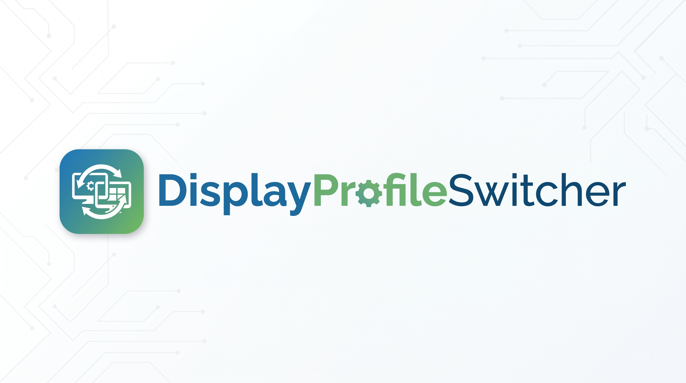

# Display Profile Switcher



Utilidad para Windows 10/11 creada en C#/.NET 8.

## Funciones

- Perfiles de **gamma**, **brillo**, **contraste** y **NVIDIA Digital Vibrance**.
- Atajos globales por perfil (`Ctrl+Alt+1`, `Ctrl+Alt+2`, etc.).
- Aplicación a monitor principal o a todos los monitores.
- Reaplicación periódica opcional del perfil, útil si un juego o el driver restaura la gamma.
- Icono en la bandeja del sistema.
- Aplicar el último perfil al iniciar.
- Inicio opcional con Windows.
- Configuración en `%APPDATA%\DisplayProfileSwitcher\profiles.json`.

## Seguridad respecto a juegos

La aplicación **no inyecta DLL, no engancha DirectX y no modifica el proceso del juego**.

- Gamma/brillo/contraste: `WindowsDisplayAPI` / gamma ramp de Windows.
- Digital Vibrance: `NvAPIWrapper` / NVAPI del driver NVIDIA.
- Atajos: `RegisterHotKey` de Windows.

## Compilar

Necesitas el **.NET 8 SDK** instalado.

1. Extrae la carpeta.
2. Ejecuta `build.bat`.
3. El ejecutable autocontenido aparecerá en:

   `publish\DisplayProfileSwitcher.exe`

También puedes abrir `DisplayProfileSwitcher.sln` en Visual Studio 2022.

### Compilar desde Ubuntu con Docker

Con Docker instalado, clona el repositorio y ejecuta este comando desde cualquier directorio (sustituye el marcador por la URL del repositorio):

```bash
git clone <URL_DEL_REPOSITORIO> DisplayProfileSwitcher && cd DisplayProfileSwitcher && ./scripts/docker-build.sh
```

El script construye la imagen con el SDK de .NET 8, publica para `win-x64` y verifica que exista `DisplayProfileSwitcher.exe` dentro de la imagen. La misma comprobación se ejecuta automáticamente en GitHub Actions sobre Ubuntu.

Esta validación confirma restauración, compilación y publicación del artefacto. Docker en Ubuntu no puede validar los elementos visuales de Windows Forms ni el comportamiento real de Windows, Win32, NVIDIA/NVAPI o los controladores de pantalla. Para esa validación se necesita ejecutar la aplicación en Windows.

### Smoke test de la interfaz en Windows

GitHub Actions ejecuta un smoke test automatizado en `windows-latest` después de publicar el ejecutable `win-x64`. Usa FlaUI UIA3 para comprobar que la ventana principal y sus controles esenciales aparecen habilitados y visibles. El test solo inspecciona la interfaz: no pulsa **Aplicar ahora**, no cambia la configuración de pantalla y no requiere hardware NVIDIA.

Esta cobertura es una validación de comportamiento de la UI, no una regresión visual pixel-perfect. Las pruebas con capturas de pantalla y baselines visuales se pueden añadir posteriormente si se necesita esa garantía.

## Perfiles iniciales

- Normal — `Ctrl+Alt+1`
- Claro — `Ctrl+Alt+2`
- Noche — `Ctrl+Alt+3`

Los valores son solo un punto de partida y se pueden editar desde la interfaz.

## Notas

- `Gamma = 1.00`, `Brillo = 50`, `Contraste = 50` y `Vibrance = 50` son los valores neutros.
- El control de Digital Vibrance requiere una GPU NVIDIA y un driver compatible.
- La gamma puede ser sobrescrita por algunos cambios de modo de pantalla, HDR, suspensión o por el propio panel de NVIDIA; para eso existe `Reaplicar`.
